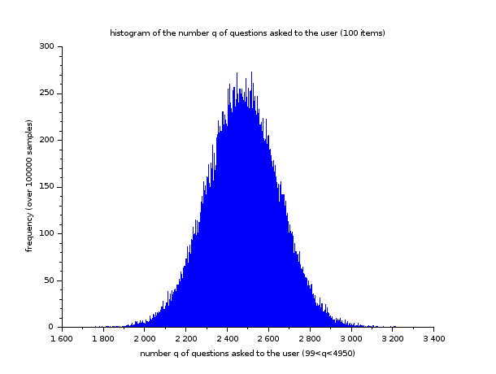
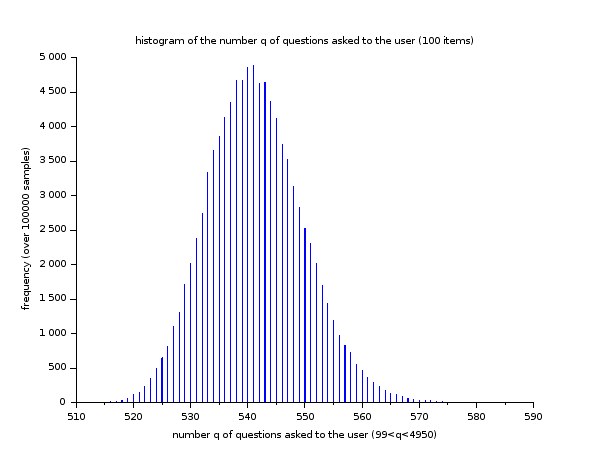

# Problem
Given a set of `N` unsorted items from a user and an ordering based on the user preferences, the aim is to sort these items while minimizing inputs from the user. More precisely, starting from the unsorted set of items, the user will be asked to compare pair of items until all the items are sorted. One assumption to ensure mathematical _well-posedness_ of the problem is that such an ordering exists. The number of times a question is asked to the user will be called the order of the solver and is denoted in the following by `q`. It can be easily shown that q is bounded from below by `N-1` and from above by `C(N,2) = N(N-1)/2`.

# Algorithm
The algorithm to sort the items starts from the set of `N` unordered items and iteratively constructs the set of ordered items. Each item in the unsorted items set is inserted in the __growing__ set of ordered items. Obviously, the two following points have the largest impact on the order `q` of the solver :

* the order in which items are taken in the initial set of unordered items;
* the algorithm used to insert an item from the set of unordered items in the set of ordered items;

# Existing solvers and associated results (_V0 of the code_)
The current _Java_ codes allow comparison of different sorting algorithms. A _scilab_ script is used for post-processing of the _Java_ results (usually written in `csv` files).
_Java_ sources are divided in three `classes`. A `User` can have several __unordered__ `Items` which can be sorted by a `Solver`. User preferences are given by the method 
```
int <U extends Item> compare(U item, U item1)
```
with specifications similar to the [compare method](https://docs.oracle.com/javase/8/docs/api/java/util/Comparator.html#compare-T-T-) from _Java_ Comparator.
The `Solver` class is abstract. Classes inheriting this class have to implement its sorting method 
```
void <U extends Item> sort(User user,U[] unorderedItems, U[] orderedItems).
```
In this method, the array of ordered items `orderedItems`, initially empty, has to be filled out from unsorted items in `unorderedItems` based on the `user` preferences.
For the time being, two solvers exist which mainly differ from the insertion algorithm used to iteratively add unsorted items in the sorted items array :
* One use a very basic and naive algorithm : starting from the bottom of the sorted items array (i.e. its first item), an unsorted item is compared to sorted items until its right place is found;
* The second one is based on insertion in a [self-balancing binary tree](https://en.wikipedia.org/wiki/Red%E2%80%93black_tree);

Obviously, the solver order `q`, which we aim to minimise, is tighlty linked to the insertion [algorithm complexity](https://www.cs.cmu.edu/~adamchik/15-121/lectures/Algorithmic%20Complexity/complexity.html). Thus, the second solver (complexity `O(log(N))`) performs much better than the first one (complexity `O(N^2`). To illustrate this, a small statistical studies can be run in the test class [SolverTest](test/SolverTest.java) over `1e5` samples and a number of items `N in [2,200]`. For `100` items, the following histograms show the various values the solver order `q` can take and their frequencies at which they occur (q being in `[99,4950]`).








The average order _(i.e. the number of questions the user have to answer to sort its items)_ for the _naive_ solver is `2475.3` while, for the binary tree based solver, the average order is `541.4`.
